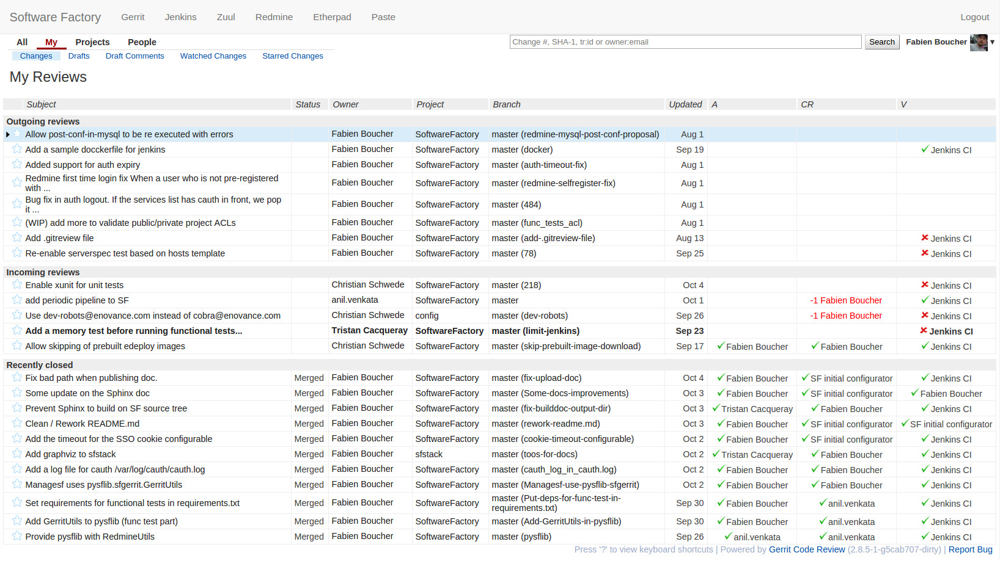
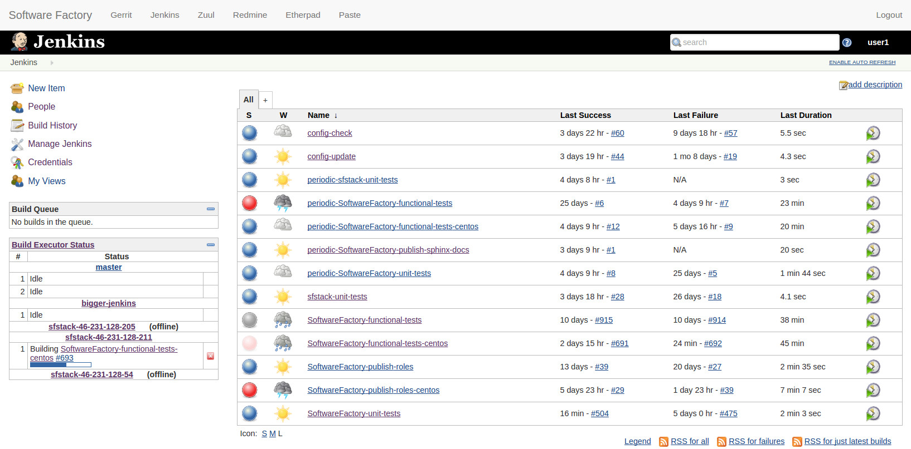
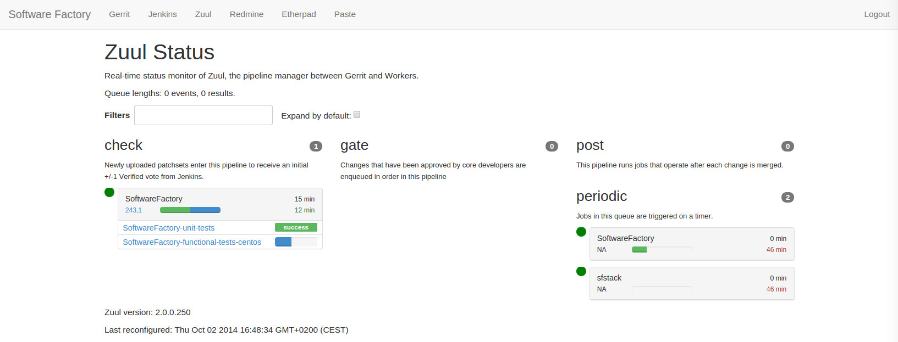
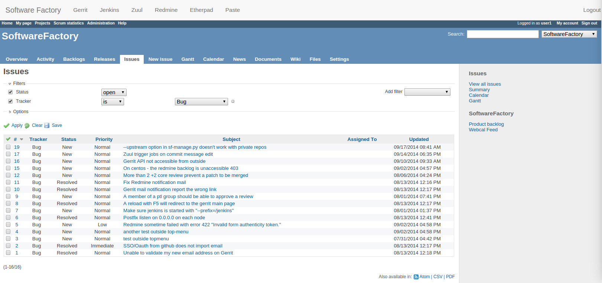
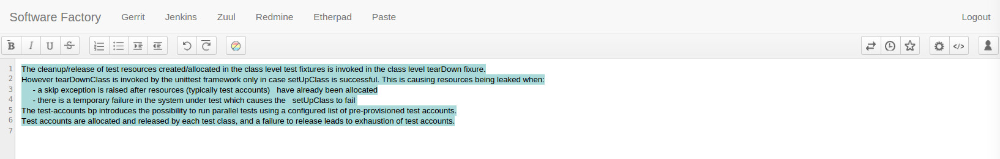
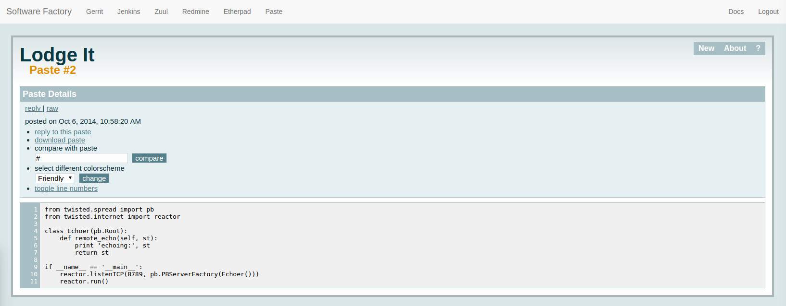
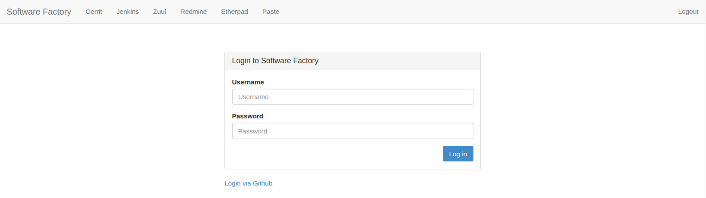

Contents:

.. toctree::

Introduction to Software Factory
================================

Software Factory (also called SF) is a collection of services that provides
a powerful platform to build software. It's designed to
run on an OpenStack-based cloud but it can also be used standalone
without features related to the cloud-like tests environments.

SF integrates services matching each step in the software
production chain:

* Code review system : `Gerrit <http://en.wikipedia.org/wiki/Gerrit_%28software%29>`_
* Issue tracker : `Redmine <http://en.wikipedia.org/wiki/Redmine>`_
* Continuous integration : `Zuul <http://ci.openstack.org/zuul/>`_
* Tests environment : `Jenkins <http://en.wikipedia.org/wiki/Jenkins_%28software%29>`_ and `Nodepool <http://docs.openstack.org/infra/system-config/nodepool.html>`_
* Collaborative tools : `Etherpad <http://en.wikipedia.org/wiki/Etherpad>`_, `Pastebin <http://en.wikipedia.org/wiki/Pastebin>`_

SF offers a seamless user experience with:

* Single Sign-On authentication with cauth
* top-menu to access all services
* dashboard

SF tests jobs, instances and pipelines configuration is done through a special project
called config and is updated through the SF integration pipeline (using code review and zuul gate).

One should know that SF is entirely developed and produced using SF.

Ready to use development platform
.................................

Setting up a development environment manually can really be
time consuming and sometimes leads to a lot of configuration
trouble. SF provides an easy way to get all services configured
and running.

The SF image can be uploaded to a Glance service, deployed on
a baremetal server or used as a LXC guest image. Once the image is running,
a configuration script 'bootstraps' needs to be executed to configure
all services using puppet.

SF does not require access to the Internet to be installed as all components are
pre installed.

SF feature an automated upgrade process continuously tested with integration test.

Below is an overview of all nodes (shown as dashed boxes) and services
and their connections to each other.

.. graphviz:: components.dot

Gerrit
......

Gerrit is the main component of SF. It provides the Git
server, a code review mechanism, and a powerful ACL system. SF
properly configures Gerrit to integrate correctly with
the issues tracker (Redmine) and the CI system (Jenkins/Zuul).

Some useful plugins are installed on Gerrit:

* Reviewer-by-blame: Automatically adds code reviewers to submitted changes according
  to git-blame result.
* Replication: Add replication mechanism to synchronize internal Git repositories
  to remote location.
* Gravatar: Because sometimes it is quite fun to have its gravatar along its
  commits and messages.
* Delete-project: Let the admin the ability to fully remove an useless Gerrit project.
* Download-commands: Ease integration of Gerrit with IDE

Some Gerrit hooks are installed to handle Redmine issues:

* An issue referenced in a commit message will be automatically
  set as "In progress" in Redmine.
* An issue referenced by a change will be closed when Gerrit merges it.

Gerrit is configured to work with Zuul and Jenkins, that means
project tests can be run when changes are proposed to a project.
Tests results are published on Gerrit as a note and can
prevent a change to be merged on the master branch.

Jenkins/Zuul
............

Jenkins is deployed along with SF as the CI component. It is
configured to work with Zuul. Zuul will control how Jenkins
perform jobs. Jenkins slaves can be added either as static slaves or as
nodepool slaves.

On SF Zuul is by default configured to provide four pipelines:

* A check pipeline
* A gate pipeline
* A post pipeline
* A periodic pipeline

Nodepool
........

Nodepool is a Jenkins slaves manager. It is design to provision and
maintain one or more pools of Jenkins slave. An OpenStack cloud account
is needed to allow nodepool to store images/snapshot and start slave VMs.
Within SF Nodepool is already pre-configured to run together with Jenkins and Zuul.

Redmine
.......

Redmine is the issue tracker inside Software Factory. Redmine
configuration done by in SF is quite standard. Additionally
SF embed the "Redmine Backlogs" plugin that eases Agile
methodologies to be used with Redmine.

Etherpad and Lodgeit
....................

Software Factory deploys along with Redmine, Gerrit and Jenkins two
additional collaboration tools. The first one is an Etherpad where team members can
live edit text documents to collaborate. This is really handy for instance to
brainstorm of design documents.

The second, Lodgeit, is a pastebin like tool that facilitates rapid
sharing of code snippets, error stack traces, ...

Unified project creation
........................

SF provides a REST service that can be used to ease SF management.
Thanks to it you can easily for instance :

* Create a project and its related user groups in a unified way.
* Add/remove users from project groups in a unified way.
* Delete a project with its related group in a unified way.
* Perform and restore a backup of the SF user data.
* ...

By unified way it means action is performed in Gerrit and on Redmine, for
instance if a user is added to the admin group of a project A
it is also added on the related Redmine and Gerrit group automatically.

Top menu - One entry point
..........................

In order to ease the usage of all those nice tools, SF provides
an unique portal served by only one remotely accessible HTTP server.
That means only one hostname to remember in order to access all
the services. Each web interface will be displayed with
a little menu on the top of your Web browser screen.
You can move around all SF services with one click.

Single Sign On
..............

As it is always a pain to deal with login/logout of each component, the
SF provides an unified authentication through Gerrit, Redmine and Jenkins.
Once your are authenticated on Gerrit your are also logged in on Redmine and Jenkins.
A logout from one service logs you out from other services as well.

Currently SF provides four kind of backends to authenticate:

* LDAP backend
* Github OAuth
* Launchpad
* local user database hosted in the managesf node

Below is the sequence diagram of the SSO mechanism.

.. graphviz:: authentication.dot

The future of Software Factory
..............................

Long term roadmap:

* Plugins interface for other issue trackers like Jira or Phabricator
* More collaborative tools like Taiga, mumble and irc server.
* Autoscaling and Heat templates.
* Developer, Project leaders, Scrum master useful dashboard.
